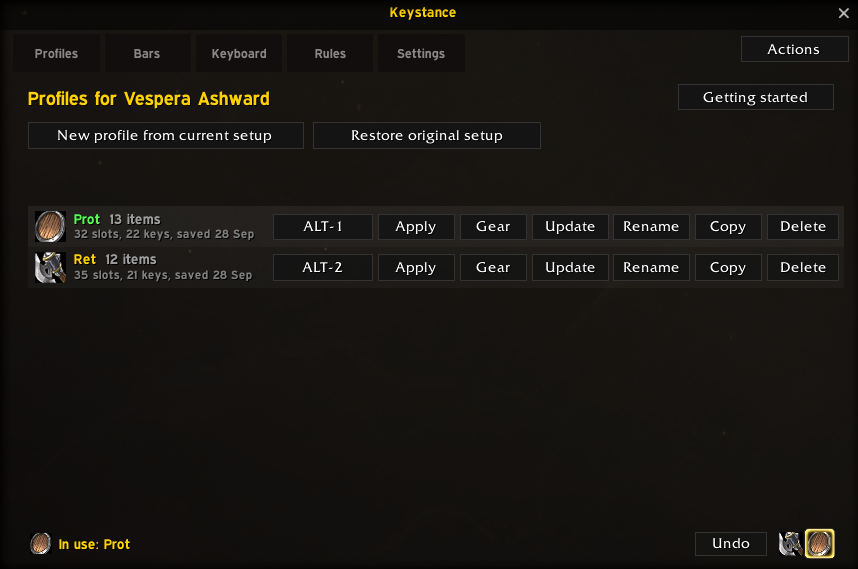
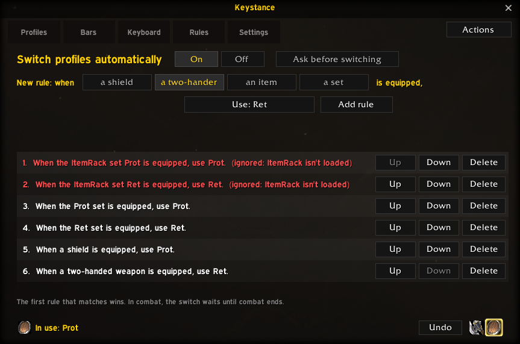
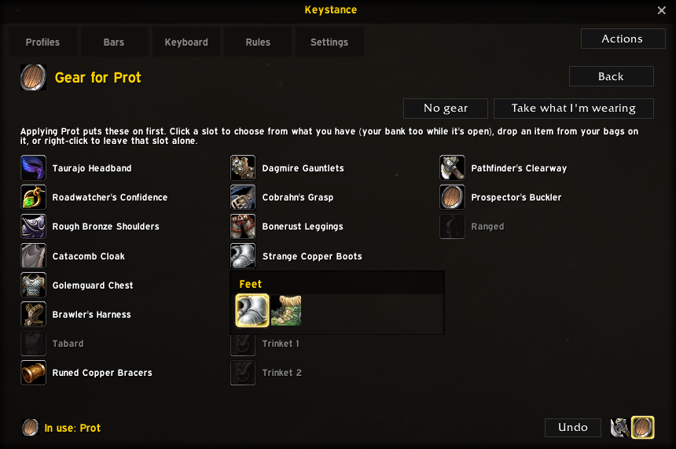
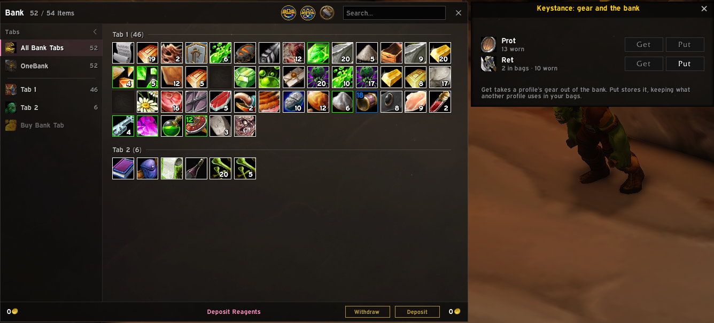
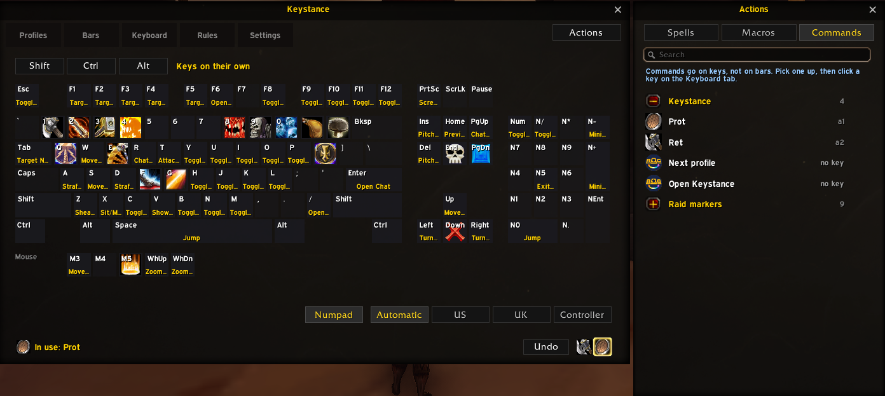
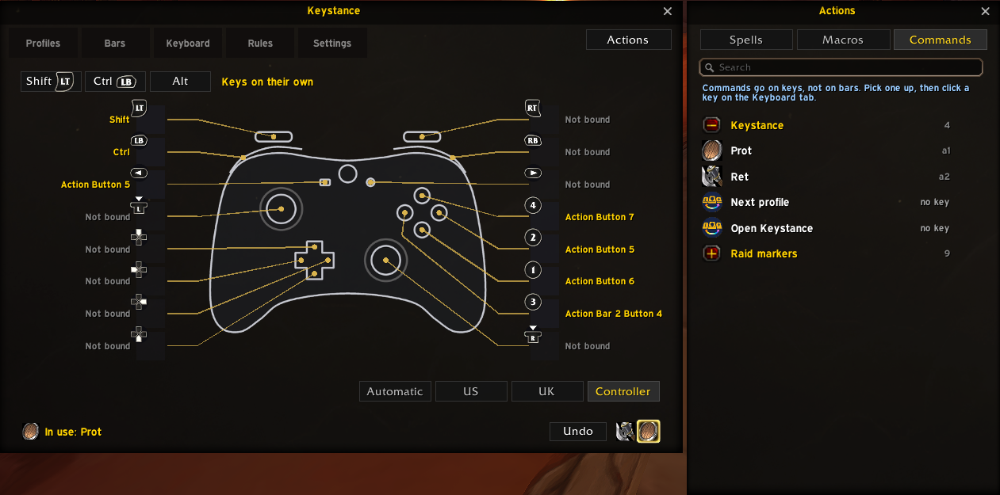
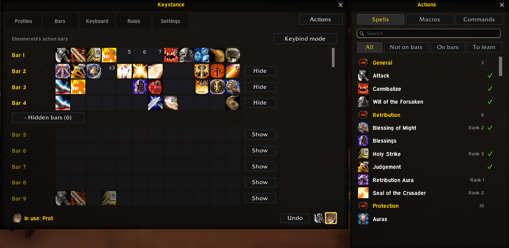
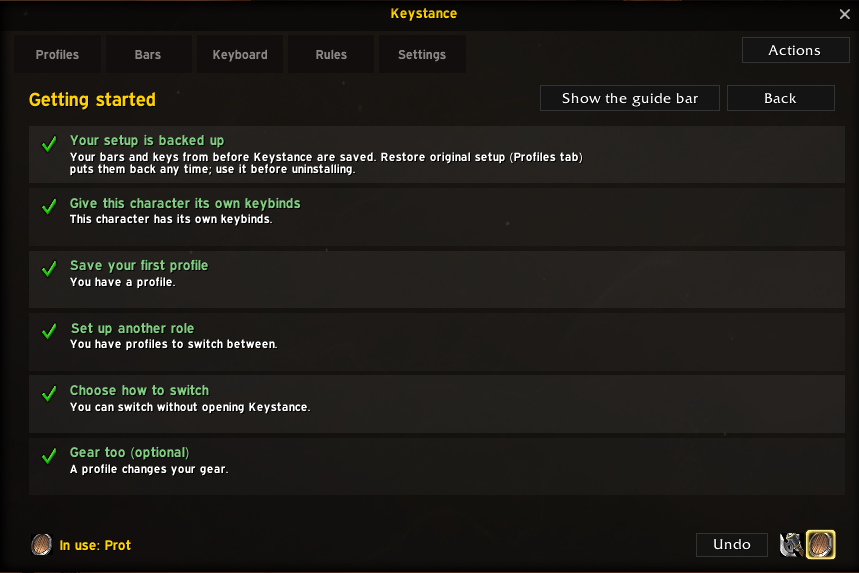
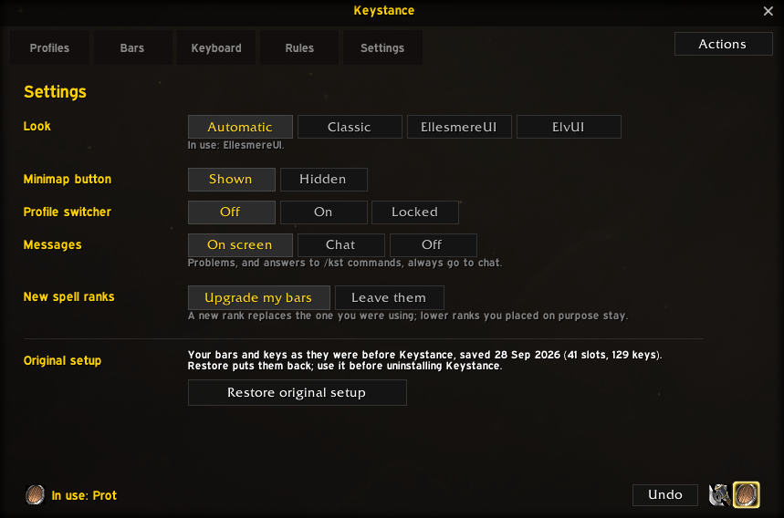
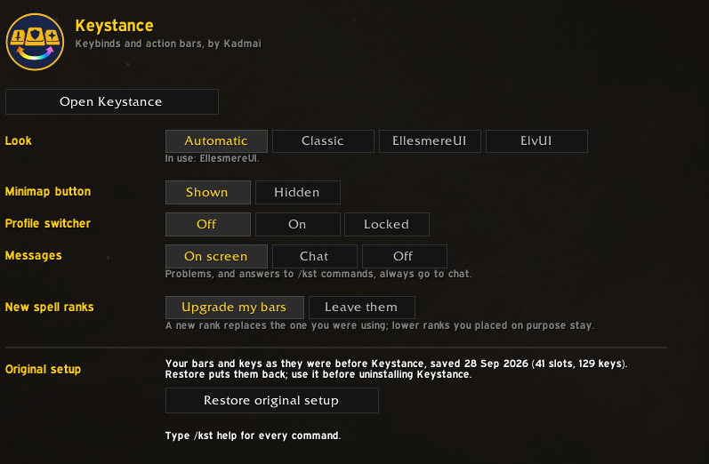

# Keystance

A keybind and action bar manager for **World of Warcraft: Forever**, by **Kadmai** (author of [Alts Forever](https://www.curseforge.com/wow/addons/alts-forever)).

Keep a set of bars, keybinds and gear for each role, and switch between them with one click, a key, or automatically when you equip a shield or a two-hander. A paladin can have Retribution, Protection and Holy setups, each with its own bars, keys and weapons.

## Profiles for each role

Save your action bars and the keys of their buttons as a profile, and apply it later. Each character has its own profiles, each with its own icon. Every change can be undone, and a profile can be updated with how your bars are now. A strip along the bottom shows which profile is in use and whether your bars still match it.

## Switching, by hand or by rule

- Click a profile, press its own key (set it from the profile's row), step through them with a "next profile" key, or use the profile switcher: a small bar you can place anywhere on screen. A switch you ask for in combat waits until combat ends.
- **Rules** switch profile automatically when you equip a shield, a two-handed weapon, a particular item, or a gear set (the game's own equipment sets or ItemRack's). You can ask to be asked first. A rule that can't work (ItemRack turned off, say) shows in red and is skipped.

## Gear, and the bank

A profile can put on gear before its bars: one of your ItemRack sets, or Keystance's own set.

- Click a slot to pick from what you have that fits: worn, in your bags, and in your bank while it's open.
- Items left in the bank are marked "In your bank" (Keystance remembers what was there on your last visit), and a soft sound plays if something can't go on.
- Undo puts gear back where it came from, including back into the bank while it's open.

A Keystance button on the bank window (Blizzard's, EllesmereUI's or ElvUI's) opens a panel to fetch a profile's gear from the bank, or store it there. Items another profile uses stay in your bags, so switching keeps working anywhere.

## See and set your keys

- **Keyboard:** see which key does what on an on-screen keyboard (US or UK layout, with or without the numpad), with the Shift, Ctrl and Alt layers, or on a controller.
- **Heat map:** colours every key by how easy it is to reach while your hand rests on your movement keys (read from your keybinds: WASD, ESDF...), from green to red, so you can see where the spells you use most would sit comfortably. Each key's tooltip gives its reach too.
- **Move your hand:** fancy E S D F instead of W A S D? "Hand right" moves your movement keys one key right and every keybind on the left of your keyboard with them, in every Shift, Ctrl and Alt layer, so each spell stays under the same finger. The column pushed off the edge wraps round to the freed left edge, so nothing is lost, and your profiles' keys move too. It asks first, Undo puts it all back, and "Hand left" goes the other way.
- **Actions panel:** your spells (and the ones still to learn), macros, raid markers, profiles and commands in one searchable list. Drag them onto your bars or straight onto a key.

Playing with a controller? The same view shows each button with what it does, and your controller's Shift and Ctrl buttons as layers.

- **Bars:** your action bars with their keys. Show or hide bars (Blizzard's, or EllesmereUI's in one click), and a keybind mode where you hover a button and press a key.

## New spell ranks

When you learn a new rank, the old one on your bars is replaced. Ranks you placed on purpose (lower than the highest you know) are left alone, and you can turn it off.

## Getting started

A short guide walks you through backing up, your first profiles and how to switch. Each step ticks itself off as you do it.

## Settings

Keystance takes on the look of your UI (the default UI, EllesmereUI or ElvUI), and its minimap button works with EllesmereUI's tray and MinimapButtonButton. Its settings are on its own Settings tab and in the game's Options > AddOns.

## Your setup is safe

- Shortly after your first login with Keystance, before it has changed anything, it saves a copy of your bars and every keybind. **Restore original setup** (Profiles tab, Settings, or `/kst restore`) puts them all back.
- **Before uninstalling Keystance, click Restore original setup.** Changes to bars and keys are kept by the game itself, so they stay after an addon is removed.
- Every change can be undone with one click. Nothing changes in combat: changes wait until combat ends. Anything that can't be set is reported and left as it was.
- A profile holds your bars and the keys of your bar buttons only. Movement and every other key are left alone.
- If your keybinds are shared by all your characters, Keystance asks before a profile changes them, and offers to give the character its own keybinds (nothing changes on screen, and your other characters keep theirs).

## Commands

`/kst` (or `/keystance`) opens Keystance.

- Profiles: `/kst save Name`, `/kst apply Name` (works in macros), `/kst undo`, `/kst restore`, `/kst profiles`, `/kst ownkeys` (give this character its own keybinds).
- Switching: `/kst auto on|off` (rules), `/kst switcher on|off|lock` (the on-screen switcher). Key Bindings > AddOns > Keystance has keys for the next profile, each profile, and opening Keystance.
- Also: `/kst ranks` (new rank replacement on or off), `/kst guide`, `/kst options` (its page in Options > AddOns), `/kst minimap` (show or hide the minimap button), `/kst skin auto|classic|ellesmere|elvui`, `/kst mem` (memory use), `/kst help`.

## Performance

Keystance does nothing while you play: no code runs every frame, windows are only built the first time you open them, and while they're closed the game's events (combat, bag and gear changes, bar and key changes) cost one check and create no garbage. It uses about 540 KB of memory with the window never opened (measured outside the game; `/kst mem` shows the real figure).

## Development

`luajit tests/run.lua` runs the tests against a fake game API; `luajit tests/perf.lua` measures memory and garbage. `python tools/install_dev.py "<WoW>\_classic_beta_"` installs a "Keystance (dev)" copy; `python tools/release.py` builds the release zip.

## Licence

MIT, see `LICENSE`.
